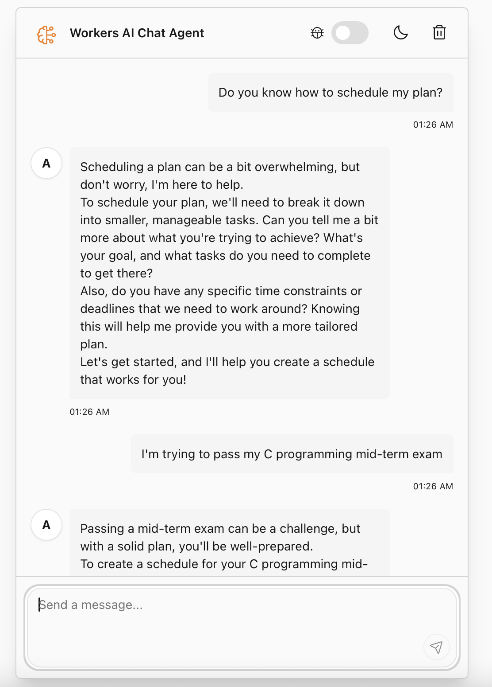
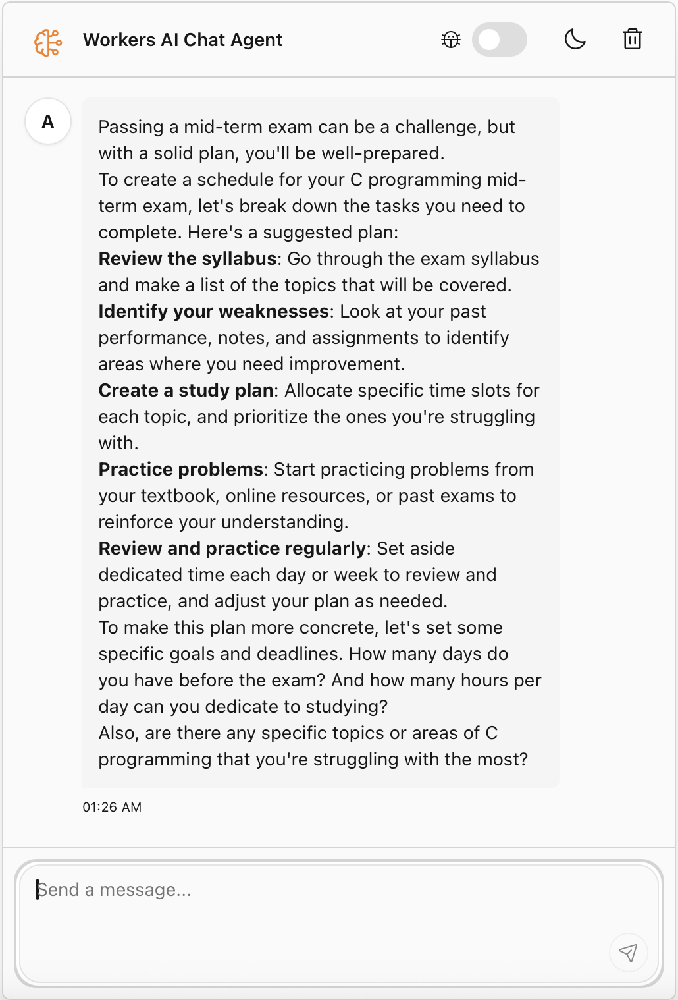

## Cloudflare Workers AI Chatbot

A lightweight AI-powered chatbot built using Cloudflare Workers AI and deployed on Cloudflare Workers.

This project is created for the Cloudflare Internship Optional Assignment, demonstrating:

- LLM using Llama 3.x on Workers AI
- Workflow / coordination using Cloudflare Workers
- Chat-based user interaction
- Memory/state via Durable Objects or simple in-process memory

This chatbot is based on Cloudflare’s official agents-starter template.
However, the LLM backend has been fully replaced from OpenAI → Llama on Workers AI, and the agent logic has been customized accordingly.

## Features

- 💬 Interactive chat interface with AI
- 🛠️ Built-in tool system with human-in-the-loop confirmation
- 📅 Advanced task scheduling (one-time, delayed, and recurring via cron)
- 🌓 Dark/Light theme support
- ⚡️ Real-time streaming responses
- 🔄 State management and chat history
- 🎨 Modern, responsive UI

## Try it

This chat bot has been deployed to Cloudflare Workers, try it now! Click->
[`Worker AI chat bot`](https://cf-ai-smart-calendar-bot.wangyx1113.workers.dev)



## Run it locally

1. clone:

```bash
git clone https://github.com/Yx-wang519/cf-ai-chat-bot.git
cd cf-ai-chat-bot
```

2. Install dependencies:

```bash
npm install
```

3. Run locally:

```bash
npm start
```

4. Deploy:

```bash
npm run deploy
```

## Project Structure

```
├── src/
│   ├── app.tsx        # Chat UI implementation
│   ├── server.ts      # Chat agent logic
│   ├── utils.ts       # Helper functions
│   └── styles.css     # UI styling
```

## References

1. [`agent-starter`](https://github.com/cloudflare/agents-starter)
2. [`workers-ai-provider`](https://sdk.vercel.ai/providers/community-providers/cloudflare-workers-ai)
3. [`Cloudflare Agents Documentation`](https://developers.cloudflare.com/agents/)

## License

MIT
